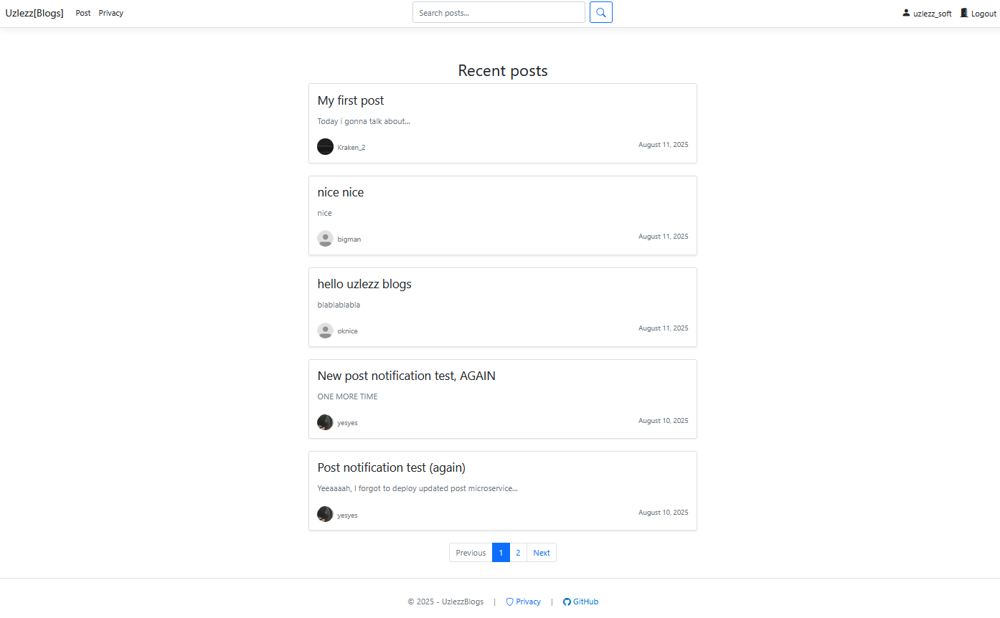
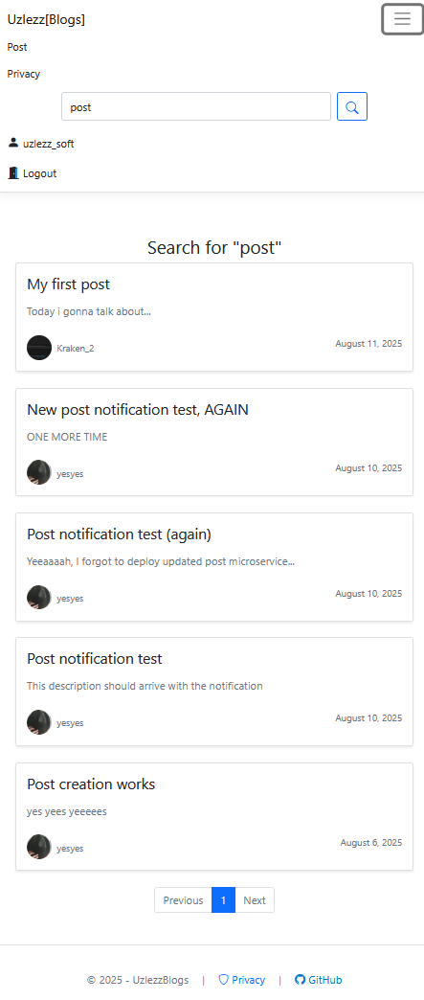

# Uzlezz Blogs

.NET 8 ASP.NET Core application. Built using Razor Pages, Hydro, and Refit for Web UI, MinimalAPI PostgreSQL, and RabbitMQ for microservices. It is [live](https://uzlezz.net) right now.


## Features

- Server-side rendering using Razor Pages with interactive bits using [Hydro](https://usehydro.dev/)
- Microservice intercommunication using RabbitMQ
- Type-safe REST api for microservices using [Refit](https://github.com/reactiveui/refit)
- Markdown processing using [Markdig](https://github.com/xoofx/markdig)
- Email notifications via [Mailkit](https://github.com/jstedfast/MailKit)


## Deployment

To build this project run

```bash
  dotnet publish
```

Website is hosted on several linux servers. Command used is

```bash
  dotnet publish -r linux-x64 -c Release
```

Each project has its own configuration in the appsettings.json. You should change database connection strings, and Rabbit MQ connection config on each microservice. Don't forget to also change API Gateway address on web UI.

Each microservice needs it's own database instance. On startup, app will create required tables if they don't exist.
## Screenshots






## 🔗 Links
[](https://uzlezz.net/Profile/uzlezz_soft)
[](https://www.linkedin.com/in/gleb-tyushkevich-0a7a21367/)

